# IDS — Архитектура

> Архитектурный документ проекта IDS (Issue Documentation System).
> Диаграммы — Mermaid (GitHub рендерит автоматически).

---

# Обзор

IDS — графическое приложение для заполнения локализаций проблем по единому
шаблону (Markdown + YAML frontmatter). Два delivery-таргета из одной кодовой базы:

| Таргет | Фреймворк | Данные | Где |
|---|---|---|---|
| **Веб** | Next.js 16 | localStorage (эмуляция ФС) | `src/` |
| **Десктоп** | Tauri 2 | реальная ФС + Git | `ids-desktop/` |

Фронтенд (React-компоненты) — **общий**. Бэкенд разный:
- Веб: localStorage (через `zustand/persist`)
- Десктоп: Rust-команды (`invoke` → `std::fs` + системный `git`)

---

# Системная архитектура

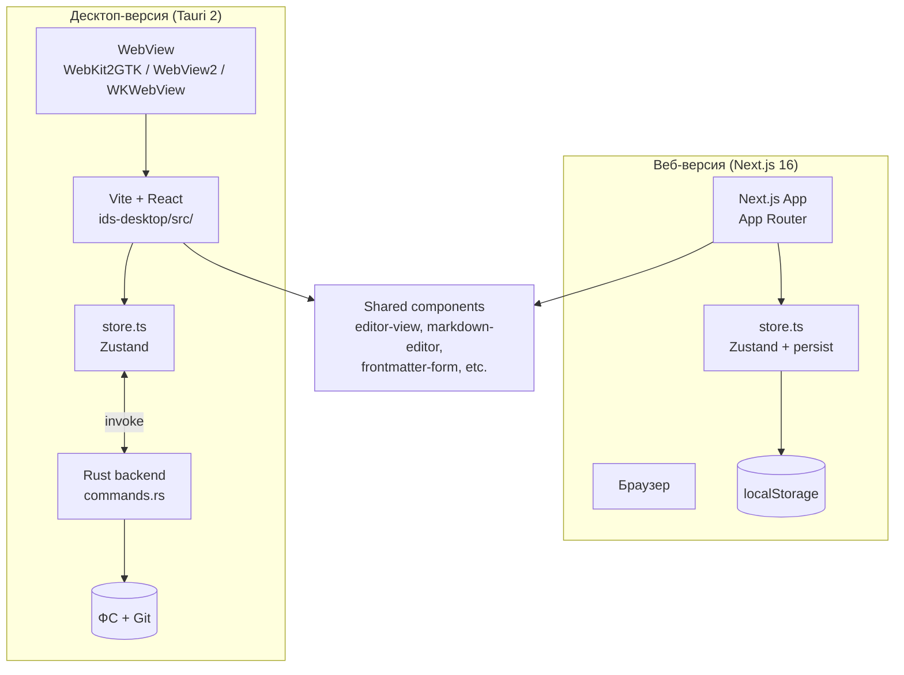

**Ключевое:** React-компоненты — общие (в `src/components/`).
Store — разный: веб-версия использует `persist` (localStorage),
Tauri-версия — `invoke()` (Rust IPC). Компоненты не знают, какой store под ними.

---

# Фронтенд: дерево компонентов

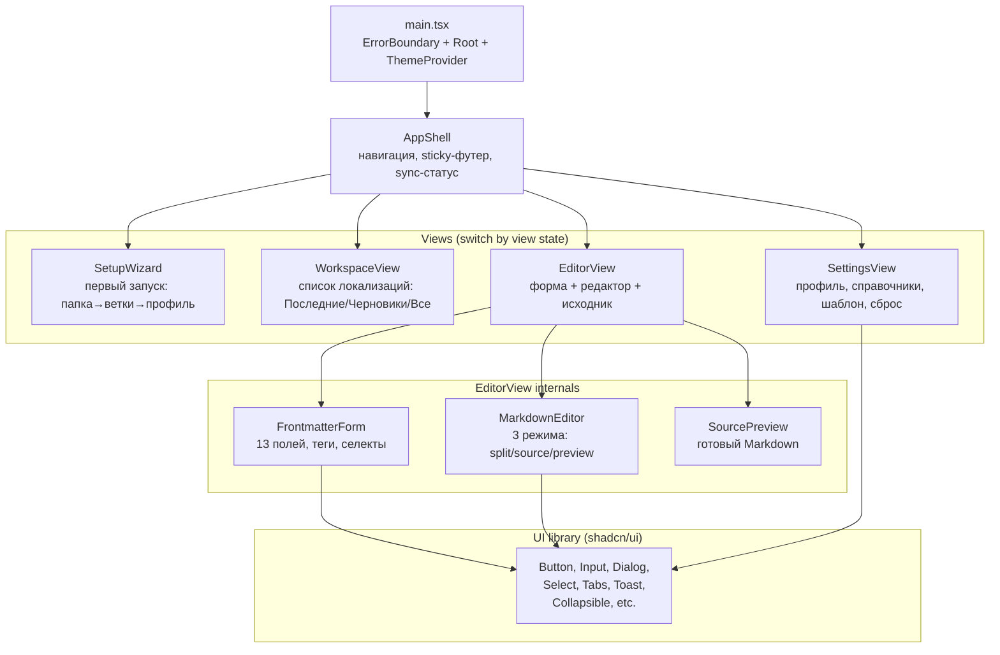

### Routing (без react-router)

Маршрутизация — через Zustand state `view`:
```
view: "setup" | "workspace" | "editor" | "settings"
```

`AppShell` рендерит компонент по `view`. Переходы:
- `setView("settings")` — кнопка шестерёнки в шапке
- `openFolder(number)` → `view = "editor"`
- `closeEditor()` → `view = "workspace"`
- `createDraft()` → `view = "editor"` (новый черновик)

---

# State management (Zustand)

```mermaid
graph LR
    subgraph "Store State"
        FILES[files: Localization[]]
        REPO[repoFiles: Record&lt;string,string&gt;]
        BASE[base: string]
        VIEW[view: View]
        EDIT[editing: &#123;number, fileId&#125;]
        SYNC[syncStatus: green/yellow/red]
        SETTINGS_STATE[settings: &#123;setupComplete, offline&#125;]
        RECENT[recentLimit: number]
    end

    subgraph "Actions"
        INIT[init&#40;&#41;]
        SETUP_ACT[completeSetup&#40;&#41;]
        CREATE[createDraft&#40;&#41;]
        UPSERT[upsertFile&#40;&#41;]
        PATCH[patchFile&#40;&#41;]
        OPEN[openFolder/openFile&#40;&#41;]
        SYNC_ACT[sync&#40;&#41;]
        RESET[resetProject&#40;&#41;]
    end

    subgraph "Selectors"
        SEL_FOLDERS[selectFolders&#40;&#41;]
    end

    ACTIONS -.->|mutate| FILES
    ACTIONS -.->|mutate| REPO
    ACTIONS -.->|mutate| VIEW
    ACTIONS -.->|mutate| EDIT
    SEL_FOLDERS -->|read| FILES
```

### Store contract (types)

```ts
interface State {
  // Данные
  files: Localization[]              // все локализации (KB + .tmp)
  repoFiles: Record<string, string>  // справочники + шаблон + config
  base: string                       // путь к папке проекта
  recentLimit: number                // N в «Последние»

  // UI
  view: View                         // текущая страница
  editing: { number: string | null; fileId: string | null }
  syncStatus: "green" | "yellow" | "red"

  // Actions
  init: () => Promise<void>
  completeSetup: (folder, name, email, branch) => Promise<void>
  resetProject: () => Promise<void>
  createDraft: () => Promise<string>
  upsertFile: (file: Localization) => Promise<void>
  patchFile: (id, patch) => Promise<void>
  openFolder: (number) => void
  openFile: (fileId) => void
  sync: () => Promise<void>
}
```

### Store: веб vs десктоп

| Аспект | Веб (store.ts) | Десктоп (store.ts) |
|---|---|---|
| Хранилище | `zustand/persist` → localStorage | invoke() → Rust → ФС |
| `init()` | читает из persisted state | `invoke("read_localizations")` |
| `upsertFile()` | обновляет state + persist | `invoke("write_file")` + state |
| `sync()` | no-op (нет Git) | `invoke("git_sync")` (pull+add+commit+push) |
| UUID | `crypto.randomUUID()` | polyfill (WebKitGTK) |
| Attachments | в state (data URLs) | на диске + lazy load |

---

# Data model

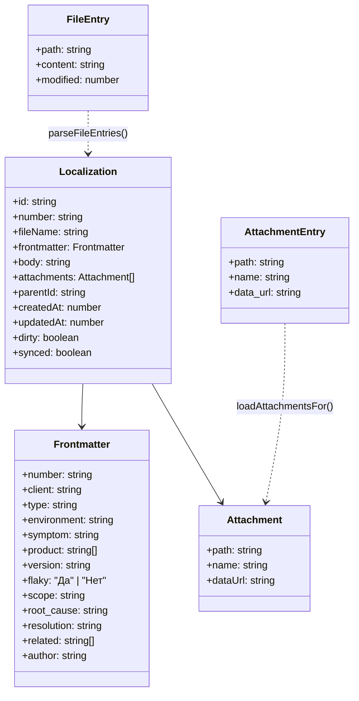

### Файл на диске (Markdown + YAML frontmatter)

```markdown
---
number: SPAS-0001
client: Холдинг Т1
type: Дефект
environment: Прод
# symptom — симптомы, часто название из дефекта
symptom: |-
  При нажатии на кнопку «Сохранить» форма зависает на 3+ секунды.
product: [SPAS-Web, SPAS-API]
# version — версия LTS-релиза и версия проблемного микросервиса, если известна
version: "1.2.3"
# flaky — плавающая ошибка?
flaky: Нет
# scope — массовость проблемы
scope: Единичное
root_cause: Несинхронная валидация блокирует UI-поток.
resolution: Перенесена в Web Worker.
# related — массив связанных задач
related: [SPAS-0005, SPAS-0012]
# author — автор локализации: "ФИО <email>"
author: "Ivan Ivanov iivanov@nota.tech"
---

# Тело документа

Подробное описание проблемы, шаги воспроизведения, логи, скриншоты.


```

---

# Файловая система (виртуальный репозиторий)

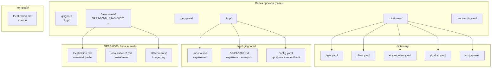

### Что где живёт

| Путь | Содержимое | Синхронизируется? |
|---|---|---|
| `.dictionary/*.yaml` | Справочники (type, client, env, product, scope) | ✓ Git |
| `_template/localization.md` | Эталонный шаблон | ✓ Git |
| `SPAS-XXXX/localization.md` | Главная локализация | ✓ Git |
| `SPAS-XXXX/localization-N.md` | Уточнения | ✓ Git |
| `SPAS-XXXX/attachments/` | Картинки/файлы | ✓ Git |
| `.tmp/tmp-xxx.md` | Недооформленные черновики | ✗ gitignored |
| `.tmp/SPAS-XXXX.md` | Черновик с номером | ✗ gitignored |
| `.tmp/config.yaml` | Профиль + recentLimit | ✗ gitignored |

**Инвариант:** `.tmp/` — личное (gitignored), всё остальное — база знаний (синхронизируется).

---

# Tauri IPC (десктоп-версия)

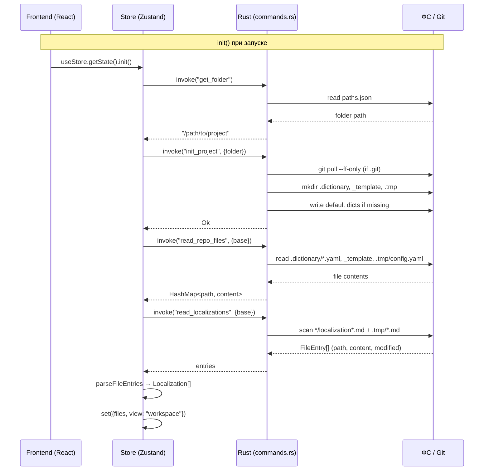

### Команды Rust ↔ Frontend

| Rust-команда | Аргументы | Возвращает | Фронтенд-вызов |
|---|---|---|---|
| `get_folder` | — | `String` (путь) | `init()` |
| `set_folder` | `folder: String` | `()` | `completeSetup()` |
| `init_project` | `folder: String` | `()` | `init()`, `completeSetup()` |
| `read_repo_files` | `base: String` | `HashMap<String, String>` | `init()` |
| `read_localizations` | `base: String` | `Vec<FileEntry>` | `init()` |
| `read_attachments` | `base, number` | `Vec<AttachmentEntry>` | `loadAttachmentsFor()` |
| `write_file` | `base, path, content` | `()` | `writeLoc()`, `upsertFile()` |
| `write_attachment` | `base, path, data_url` | `()` | `writeLoc()` (binary) |
| `delete_file` | `base, path` | `()` | `patchFile()` (old .tmp) |
| `git_sync` | `base, commit_message, author...` | `()` | `sync()` |
| `git_branches` | `folder` | `Vec<String>` | `SetupWizard` |
| `git_checkout_pull` | `folder, branch` | `()` | `completeSetup()` |

### CREATE_NO_WINDOW (Windows)

Все `git`-вызовы — через `git_command()` хелпер:
```rust
fn git_command(args: &[&str]) -> Command {
    let mut cmd = Command::new("git");
    cmd.args(args);
    #[cfg(windows)]
    {
        use std::os::windows::process::CommandExt;
        cmd.creation_flags(0x08000000); // CREATE_NO_WINDOW
    }
    cmd
}
```
Без этого на Windows GUI-приложение создаёт видимое консольное окно при каждом `git pull/sync`.

---

# Ключевые сценарии (sequence diagrams)

## 1. Создание локализации (createDraft → save → sync)

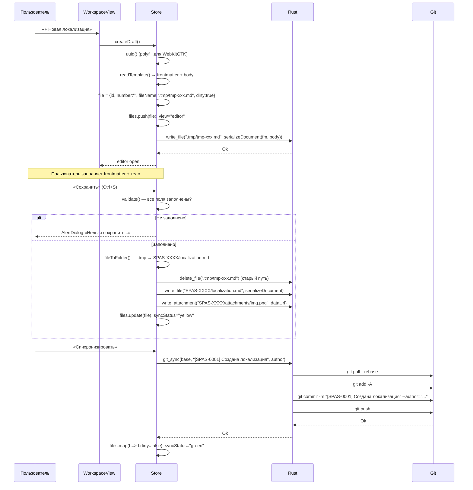

## 2. Открытие локализации на просмотр (с attachments)

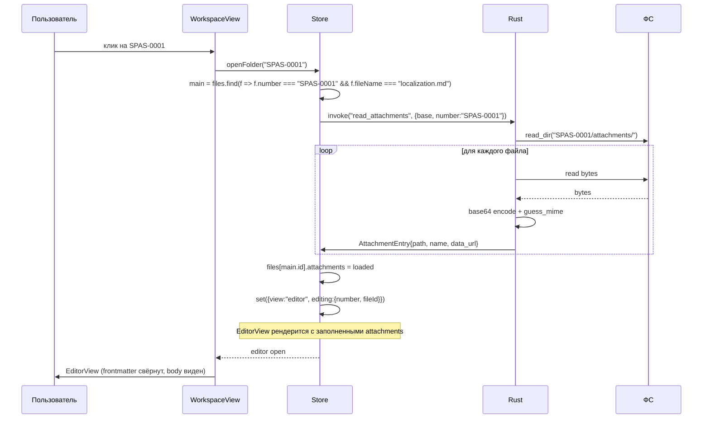

**Важно:** `loadAttachmentsFor()` вызывается ДО `set({editing})` — к моменту рендера
EditorView `activeFile.attachments` уже заполнен, useEffect инициализирует локальный state.

## 3. Уточнение локализации (clarify)

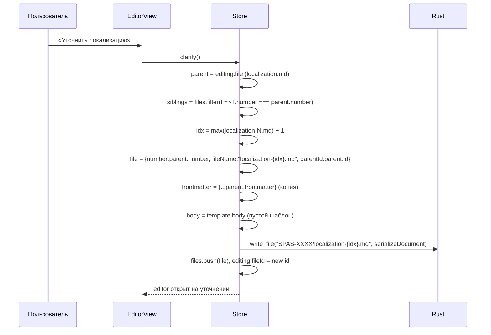

---

# Frontmatter сериализация (кастомный YAML)

```mermaid
graph LR
    subgraph "Frontmatter (TS object)"
        FM[Frontmatter<br/>13 полей]
    end

    subgraph "serializeFrontmatter()"
        ORDER[Фиксированный порядок полей<br/>number → client → type → env →<br/>symptom → product → version → ...]
        COMMENT[Комментарии из эталона<br/># symptom — симптомы...]
        BLOCK[block scalar |-<br/>symptom, root_cause, resolution]
        FLOW[flow массивы<br/>product: [a, b, c]]
        QUOTE[doubleQuote для опасных<br/>version: "1.2"]
    end

    subgraph "YAML output"
        YAML[---<br/>number: SPAS-0001<br/>...<br/>---]
    end

    FM --> ORDER
    ORDER --> COMMENT
    ORDER --> BLOCK
    ORDER --> FLOW
    ORDER --> QUOTE
    COMMENT --> YAML
    BLOCK --> YAML
    FLOW --> YAML
    QUOTE --> YAML
```

**Почему не `js-yaml`?**
- `js-yaml` не сохраняет порядок полей (сортирует по алфавиту)
- `js-yaml` не сохраняет комментарии
- Эталонный шаблон требует точного воспроизведения (порядок + комментарии + block scalar `|-`)

Кастомный сериализатор (~110 строк) гарантирует:
1. Порядок полей — как в эталоне
2. Комментарии перед `symptom`, `product`, `version`, `flaky`, `scope`, `related`, `author`
3. `symptom` — block scalar `|-` (многострочный)
4. `root_cause`/`resolution` — block scalar если есть переносы
5. `product`/`related` — flow массивы `[a, b]`
6. Строки с опасными символами — double-quoted

---

# CI/CD pipeline

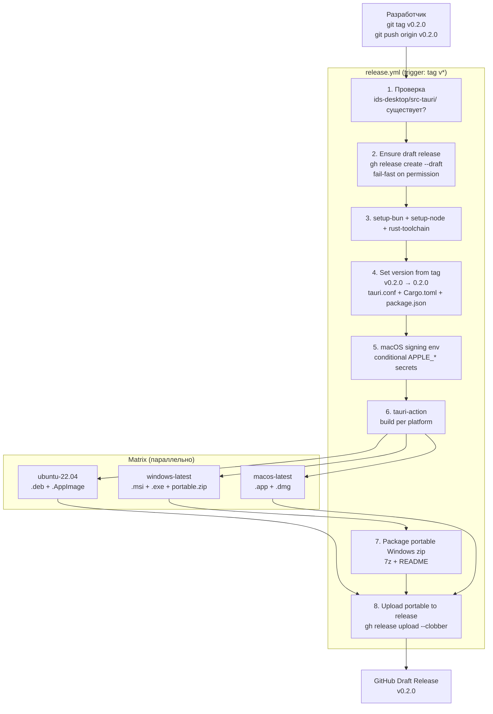

### Артефакты по платформам

| Платформа | Артефакты | Зависимости |
|---|---|---|
| **Linux** | `.deb`, `.AppImage` | libwebkit2gtk-4.1 (системная) |
| **Windows** | `.msi` (инсталлер), `.exe` NSIS (инсталлер), `.zip` (portable) | WebView2 runtime (Win11 предустановлен, Win10 — bootstrapper) |
| **macOS** | `.app`, `.dmg` | WKWebView (системный). Unsigned → `xattr -cr`. Notarized → если APPLE_* secrets заданы |

### Шаги release.yml (14 шагов)

```
1.  actions/checkout
2.  Проверка ids-desktop/src-tauri
3.  Ensure draft release (fail-fast on permission)
4.  oven-sh/setup-bun
5.  actions/setup-node (v22)
6.  dtolnay/rust-toolchain
7.  Linux system deps (webkit2gtk-4.1) [ubuntu only]
8.  Install frontend deps (bun install)
9.  Generate icons (logo.svg → tauri icon)
10. Set version from git tag (v0.2.0 → 0.2.0)
11. Prepare macOS signing env (conditional APPLE_*)
12. tauri-apps/tauri-action (build + upload to release)
13. Package portable Windows zip [windows only]
14. Upload portable zip to GitHub Release [windows only]
```

---

# Deployment

## Веб-версия (Next.js standalone)

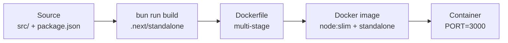

```bash
# Production
docker compose up app --build    # http://localhost:3000

# Dev (hot-reload)
docker compose up dev            # http://localhost:3000
```

## Десктоп-версия (Tauri)

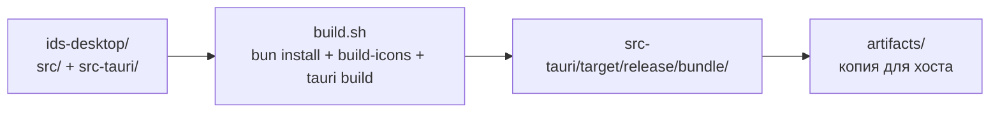

### Cross-platform сборка

| Где | Как | Артефакт |
|---|---|---|
| Linux (Docker) | `docker compose --profile tauri run --rm tauri` → `bash build.sh` | `.deb`, `.AppImage` |
| Windows | на Windows: `cd ids-desktop && bash build.sh` | `.msi`, `.exe`, `.zip` |
| macOS | на macOS: `cd ids-desktop && bash build.sh` | `.app`, `.dmg` |
| **CI (matrix)** | `git tag v* && git push origin v*` → release.yml | все 3 платформы |

**Кросс-компиляция невозможна** — Tauri требует нативный Rust + системный WebView для каждой платформы.

---

# Безопасность

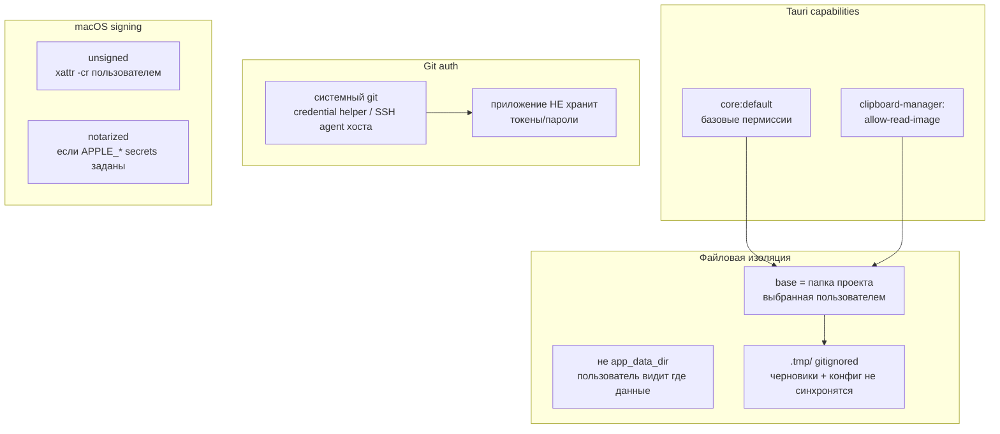

### Threat model

| Угроза | Защита |
|---|---|
| Arbitrary file read/write | Все пути — относительно `base` (папка проекта). Rust `join(base, rel)` — не выходит за base. |
| Credential leak | Git auth — через системный git (credential helper/SSH). Приложение не трогает. |
| Local drafts sync | `.tmp/` в `.gitignore` — черновики + config никогда не уходят в remote. |
| Clipboard access | `clipboard-manager:allow-read-image` — только чтение, не запись. |
| Unsigned macOS app | `xattr -cr` workaround (README §7) или notarization (APPLE_* secrets). |

---

# Известные нюансы (и почему так)

## 1. UUID polyfill (WebKit2GTK)

```mermaid
graph LR
    CALL[createDraft / clarify]
    UUID[uuid&#40;&#41;]
    CHECK{crypto.randomUUID<br/>exists?}
    NATIVE[crypto.randomUUID&#40;&#41;<br/>Windows/macOS/modern WebKit]
    FALLBACK[Math.random pattern<br/>xxxxxxxx-4xxx-yxxx-...]
    CRASH[TypeError → белый экран]

    CALL --> UUID
    UUID --> CHECK
    CHECK -->|yes| NATIVE
    CHECK -->|no| FALLBACK
    NATIVE -.->|WebKitGTK &lt; 2.40| CRASH
    FALLBACK -.->|работает везде| OK[ok]
```

WebKit2GTK на Ubuntu 22.04 (~2.38) не имеет `crypto.randomUUID()` → crash → белый экран.
Polyfill: проверка `typeof crypto.randomUUID === 'function'`, fallback на `Math.random`.

## 2. oklch() → hex (WebKit2GTK CSS)

shadcn/ui тема использует `oklch()` (CSS Color Level 4). WebKit2GTK ~2.38 не поддерживает → все 62 color variables invalid → transparent → белый экран. Фикс: oklch → hex/rgba конверсия.

## 3. PostCSS isolation

```mermaid
graph TB
    PARENT[repo/postcss.config.mjs<br/>Next.js: plugins: ["@tailwindcss/postcss"]]
    WALK[postcss-load-config<br/>идёт ВВЕРХ по дереву]
    IDS[ids-desktop/]
    FOUND[находит родительский<br/>string format invalid для Vite]
    CRASH[Invalid PostCSS Plugin<br/>build fails]

    PARENT --> WALK
    WALK --> IDS
    IDS --> FOUND
    FOUND --> CRASH

    FIX1[ids-desktop/postcss.config.cjs<br/>plugins: [] (stop search)]
    FIX2[vite.config.ts<br/>css.postcss: { plugins: [] }]

    IDS -.->|fix r40| FIX1
    IDS -.->|fix r40| FIX2
```

Два уровня изоляции:
1. `ids-desktop/postcss.config.cjs` — локальный пустой конфиг, `cosmiconfig` находит его первым.
2. `vite.config.ts` `css.postcss: { plugins: [] }` — inline, Vite не ищет файл.

## 4. CRLF → LF (Windows frontmatter)

```mermaid
graph LR
    WIN[Windows git checkout<br/>core.autocrlf=true]
    CRLF[файлы с \r\n]
    REGEX[regex /^---\n.../]
    NOMATCH[не матчит ---\r\n]
    BUG[m=null → body = весь файл<br/>frontmatter в теле]

    WIN --> CRLF
    CRLF --> REGEX
    REGEX --> NOMATCH
    NOMATCH --> BUG

    FIX[normalize: content.replace&#40;\r\n, \n&#41;<br/>перед regex]
    CRLF -.->|fix r42| FIX
```

Windows git конвертирует LF → CRLF при checkout. Regex на `\n` не матчит `---\r\n` → парсинг ломается. Фикс: нормализация перед regex + `serializeDocument` нормализует body + `.gitattributes` (`eol=lf`).

## 5. Ctrl+V картинок на Linux (WebKit2GTK)

```mermaid
graph TB
    PASTE[Ctrl+V в textarea]
    ITEMS[clipboardData.items]
    CHECK{image File item?}
    WIN_PATH[Windows/macOS<br/>getAsFile → handleImageFile]
    LIN_EMPTY[Linux WebKitGTK<br/>items не экспонирует image]
    FALLBACK[readImage&#40;&#41; plugin<br/>arboard: X11 clipboard]
    CANVAS[canvas RGBA → PNG<br/>toDataURL]
    INSERT[insertImageAttachment]

    PASTE --> ITEMS
    ITEMS --> CHECK
    CHECK -->|yes| WIN_PATH
    CHECK -->|no text| FALLBACK
    WIN_PATH --> INSERT
    FALLBACK --> CANVAS
    CANVAS --> INSERT
```

WebKit2GTK на Linux не экспонирует image как `File` item в `clipboardData`. Tauri clipboard-manager плагин (arboard под капотом) читает системный буфер напрямую. RGBA → PNG через canvas.

---

# Файлы проекта (карта)

```
ids/
├── src/                          # Веб-версия (Next.js 16)
│   ├── app/                      # App Router (page, layout, api)
│   ├── components/               # Общие React-компоненты
│   │   ├── app-shell.tsx         #   навигация + sticky-футер
│   │   ├── workspace-view.tsx    #   список локализаций
│   │   ├── editor-view.tsx       #   форма + редактор + исходник
│   │   ├── frontmatter-form.tsx  #   13 полей
│   │   ├── markdown-editor.tsx  #   3 режима, paste/drop
│   │   ├── settings-view.tsx    #   профиль, справочники
│   │   ├── setup-wizard.tsx      #   первый запуск
│   │   └── ui/                   #   shadcn/ui компоненты
│   ├── lib/
│   │   ├── types.ts              #   Frontmatter, Localization, Attachment
│   │   ├── frontmatter.ts        #   кастомный YAML-сериализатор
│   │   ├── store.ts              #   Zustand store (localStorage)
│   │   ├── repo.ts               #   виртуальная ФС + dictionaries
│   │   └── template.ts           #   эталонный шаблон
│   └── hooks/                    #   use-toast, use-mobile
│
├── ids-desktop/                  # Десктоп (Tauri 2) — self-contained
│   ├── src/
│   │   ├── main.tsx              #   ErrorBoundary + Root
│   │   ├── components/           #   копия src/components/ (отредактированная)
│   │   └── lib/
│   │       ├── store.ts          #   Zustand store (invoke → Rust)
│   │       └── ...               #   frontmatter, repo, types (копии)
│   ├── src-tauri/
│   │   ├── src/
│   │   │   ├── main.rs           #   entry
│   │   │   ├── lib.rs            #   register commands + plugins
│   │   │   └── commands.rs       #   Rust-команды (ФС, git, clipboard)
│   │   ├── Cargo.toml            #   deps: tauri, serde, base64, clipboard
│   │   ├── tauri.conf.json       #   productName, bundle targets
│   │   └── capabilities/
│   │       └── default.json      #   permissions
│   ├── build.sh                  #   turnkey: install + icons + tauri build
│   ├── build-icons.sh            #   logo.svg → tauri icons
│   ├── vite.config.ts            #   Vite + @tailwindcss/vite + postcss isolation
│   └── package.json
│
├── .github/workflows/
│   ├── ci.yml                    #   web: lint + build (push/PR)
│   └── release.yml               #   Tauri matrix: ubuntu/windows/macos (tag v*)
│
├── docker/
│   └── tauri.Dockerfile          #   Rust + webkit2gtk + bun
├── Dockerfile                    #   Next.js standalone (multi-stage)
├── docker-compose.yml           #   dev + app + tauri
├── clean.sh                      #   очистка build-артефактов
├── .gitattributes                #   eol=lf (превент CRLF на Windows)
└── README.md
```

---

# Сводка технических решений

| Решение | Почему | Альтернатива | Почему нет |
|---|---|---|---|
| Кастомный YAML-сериализатор | Порядок полей + комментарии + block scalar | js-yaml | Не сохраняет порядок и комментарии |
| Zustand (не Redux) | Простой, без boilerplate, hooks-native | Redux Toolkit | Слишком много кода для малого проекта |
| Tauri 2 (не Electron) | Меньший размер (~10МБ vs ~100МБ), Rust backend, системный WebView | Electron | Тяжёлый (Chromium в каждом app) |
| shadcn/ui (не MUI) | Копирование исходников (контроль), Tailwind-native | MUI / Ant Design | emotion/JSS, не Tailwind, тяжелее |
| Rust на host git (не git2 crate) | Системный credential helper/SSH работает | git2 crate | Нужен SSH-ключ в приложении |
| .tmp/ gitignored | Локальные черновики + конфиг не синхронятся | Синхронить .tmp | Конфликт засекреченных данных |
| paths.json в app_data_dir | Стандартное место Tauri, переживает reinstall | В репо | Путь к репо — пользовательский, не в git |
| CRLF normalize в JS | Работает даже если .gitattributes не применился | Только .gitattributes | Git на Windows может override |
| oklch → hex | WebKit2GTK Ubuntu 22.04 не поддерживает oklch | oklch + @supports | @supports для oklch ненадёжный |
| UUID polyfill | WebKit2GTK < 2.40 нет crypto.randomUUID | Только crypto.randomUUID | Crash на Ubuntu 22.04 |
| CREATE_NO_WINDOW | Windows GUI spawn-ит видимое консольное окно | Показывать консоль | UX: мигает при каждом git call |

---

*Архитектурный документ проекта IDS (Issue Documentation System).*
*Диаграммы: Mermaid (рендерится на GitHub).*
